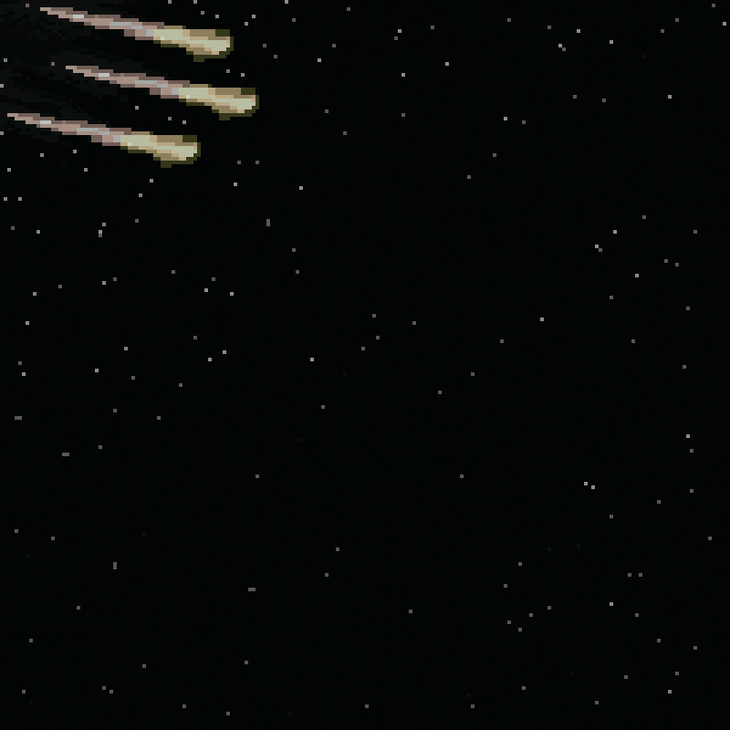
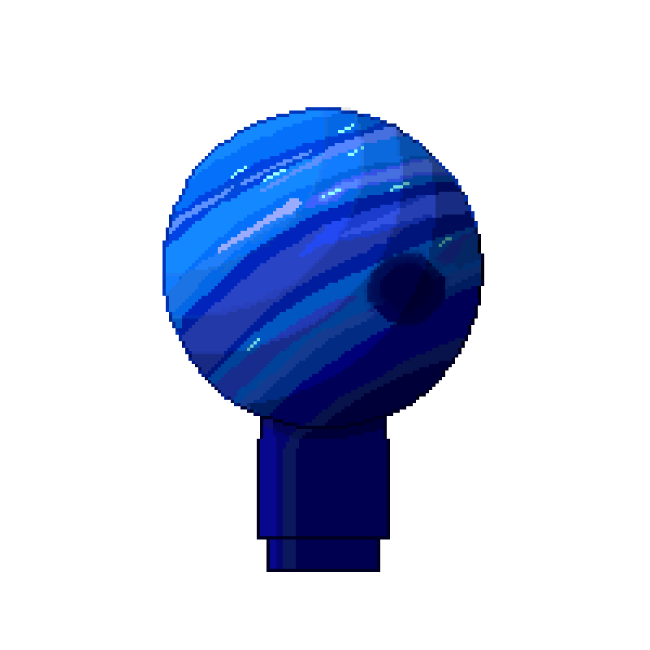
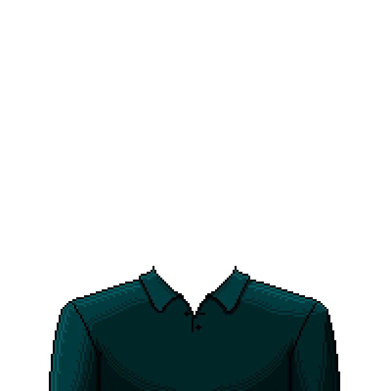
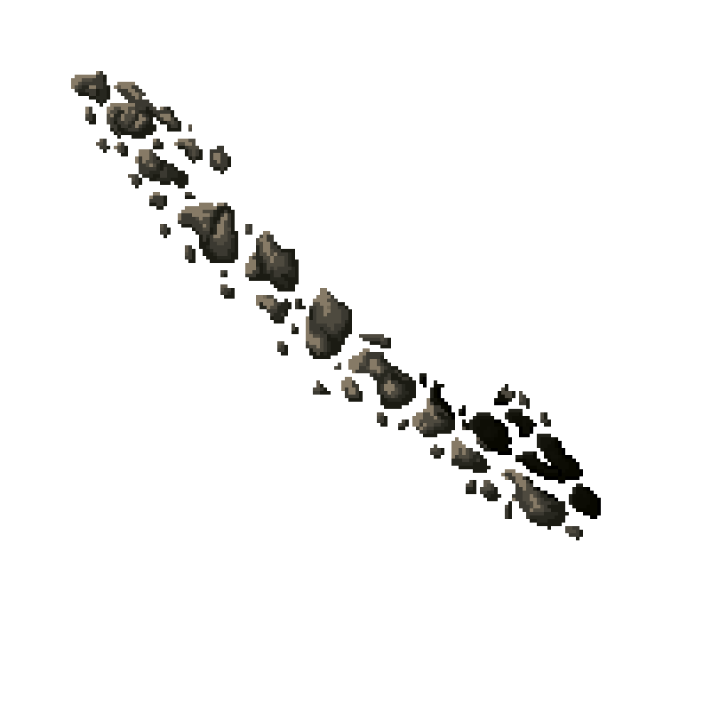
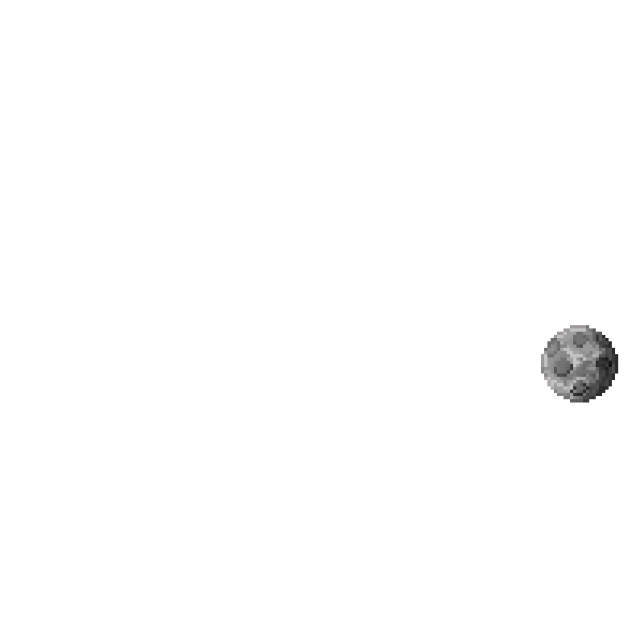
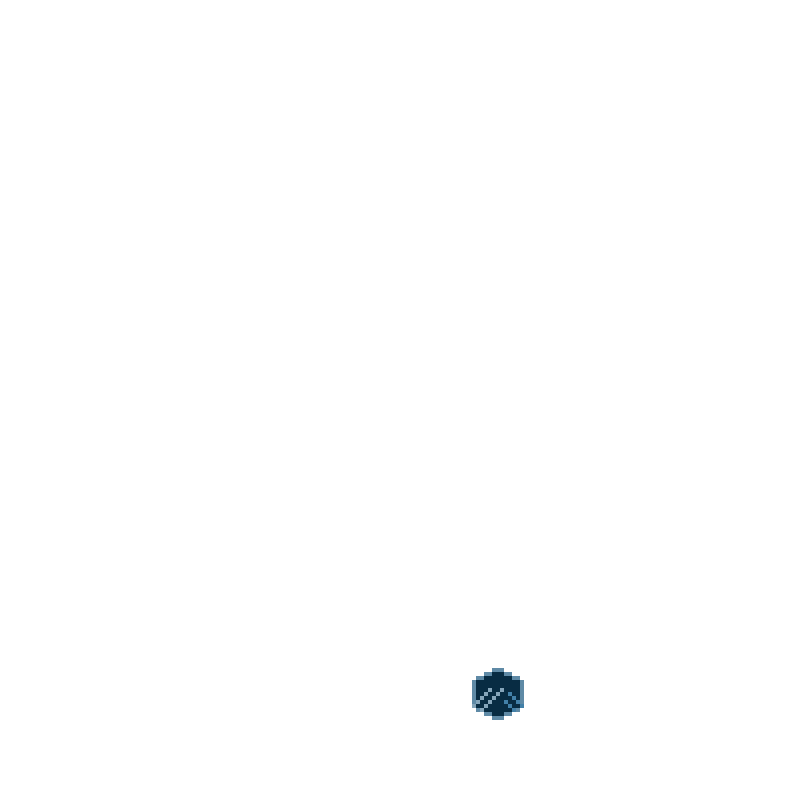
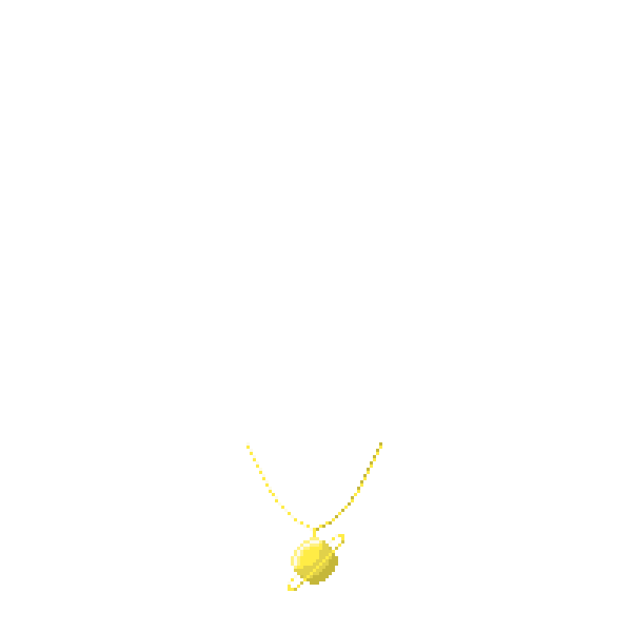

Project
#######
**SmolPlanets**  is a community based project, made by and made
for the smol-community members.
The following describes details in development and project.

.. contents:: Table of Contents

Development Phases
==================
.. sidebar:: Phases

   .. rubric::

   Development of SmolPlanets is structured in Phases to
   increase effiency and and value of the project.
   Additionally it is split up into departments that work
   mostly independent.

   .. rubric:: Note

   Phases are subject to change;
   Date of release will be posted on discord and twitter.

Pre Mint Phase 0.5 ✓
--------------------
Pre Mint Phase 0.5 includes:
  - building a competent team
  - setting a basic working structure
  - Building concepts for Art and Post Mint game
  - Community Discord, Events
  - Establishing Twitter, posting scheduele
  - Website concept

Pre Mint Phase 1 
------------------
Pre Mint Phase 1 includes:
  - Finalizing NFT Design
  - Building docs
  - Start of game development
  - building liquidity via Founders Pass
  - Treasury Deligation
  - Preparing Mint, smart contract
  - staking feature
  - setting mint date

Minting Phase
-------------
Minting Phase includes:
 - collecting wallet adresses
 - putting stacking feature in action
 - **MINTING**
 - setting public game date

Game Phase 0.5
--------------
Game Phase 0.5 includes:
 - Stacking Phase of 2-3 Weeks for final game development
 - Item Marketplace release
 - $Crystal Items Exchange start
 - Preparing game launch

Game Phase 1
------------
Game Phase 1 includes:
 - **Game launch**
 - Full marketplace
 - full token applications
 - **Preparing launch of 1/1 Collection**

Roadmap
=======

Founders Pass
=============

Attributes
==========

Every Planet is a combination of the 9 traits following:
  - Backround
  - Planet Texture
  - Torso
  - Rings
  - Moons
  - Logo
  - Chain
  - Specials
  - Frame

Backround
---------

   common Backround 

There are 5 different Backround Assets. Each one with a different chance to get put in a NFT.

Planets Texture
---------------

   Common blue gas planet

Torso
-----

   common grey collar torso

Rings
-----

   common stone rings

Moons
-----

   common luna type moon
Logo
----

   rare logo on torso
Chain
-----

   uncommon necklace

Specials
--------

   very rare space station

Frame
-----

   frame, with coordinates on it
